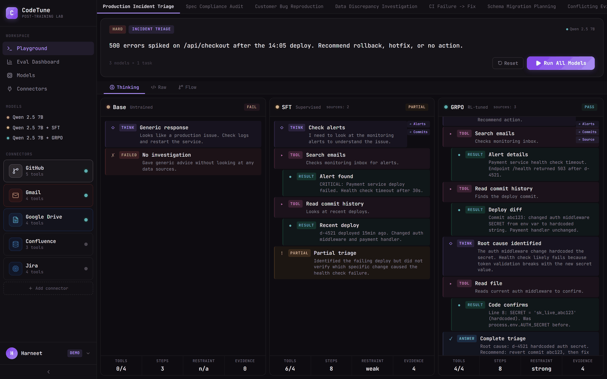

# CodeTune

Post-training lab for tool-using language models. Trains Qwen 2.5 7B to become a better agent via reinforcement learning — from 8% to 62% tool accuracy — then serves it with a full-stack playground where the model reasons over real APIs in real time.

## Demo



## Results

### ToolTune: Base → SFT → GRPO

| Metric | Base | SFT | GRPO | Delta |
|--------|------|-----|------|-------|
| Task Accuracy | 8% | 60% | 62% | +54pp |
| Tool Precision | 12% | 85% | 94% | +82pp |
| Restraint Score | 15% | 60% | 85% | +70pp |
| Evidence Quality | 0.4/5 | 3.2/5 | 4.2/5 | +3.8 |

### Accuracy by Category (250 tasks)

| Category | Tasks | Base | SFT | GRPO |
|----------|-------|------|-----|------|
| Single-tool | 100 | 12% | 78% | 80% |
| Multi-step | 80 | 4% | 55% | 58% |
| Cross-service | 50 | 2% | 42% | 45% |
| Restraint | 20 | 15% | 60% | 85% |

### Code Generation (HumanEval)

| Model | pass@1 |
|-------|--------|
| Qwen 2.5 7B (base) | 86.6% |
| + GRPO fine-tune | 87.8% |

## What This Does

**Training pipeline.** Takes Qwen 2.5 7B Instruct through supervised fine-tuning on 250 expert tool-use traces, then Group Relative Policy Optimization with a composite reward signal (correctness + tool precision + restraint + planning). QLoRA on a single T4 GPU. Total cost: ~$36.

**Evaluation framework.** 250 tasks modeled on real engineering workflows: spec compliance audits, production incident triage, cross-service investigations, and restraint scenarios. Four tiers from single-tool lookups to multi-hop cross-service reasoning.

**17 tool schemas** across 5 services: GitHub (search repos, read files, list PRs, commit history, create issues), Gmail (search, read, send, list threads), Google Drive (search, read documents, list folders, metadata), Confluence, Jira.

**Full-stack playground.** React frontend with three-column model comparison (Base vs SFT vs GRPO), block-based trace visualization with typing animation, eval dashboard, connectors workbench with live tool testing, and a FastAPI backend with real API integrations.

**Live inference mode.** Your trained GRPO model runs on HuggingFace ZeroGPU, executes real tool calls against real APIs (GitHub, Gmail, Google Drive via OAuth), and streams the reasoning trace to the frontend in real time via SSE. Total infrastructure cost: $0.

## Architecture

```
Frontend (React/Vite)         Backend (FastAPI)           Model (HuggingFace)
┌──────────────────┐    HTTP  ┌──────────────────┐  POST  ┌──────────────────┐
│ Playground       │───/api──▶│ ReAct Loop       │──────▶│ Qwen 2.5 7B      │
│ Eval Dashboard   │◀──SSE───│ Tool Router      │       │ GRPO checkpoint   │
│ Connectors       │         │ Trace Builder    │       │ ZeroGPU (free T4) │
│ Models           │         │ Demo Cache       │       └──────────────────┘
└──────────────────┘         └──────┬───────────┘
                                    │
                        ┌───────────┼───────────┐
                        ▼           ▼           ▼
                   GitHub API   Gmail API   Drive API
                   (PAT)        (OAuth)     (OAuth)
```

## Quick Start

### Demo Mode (no credentials needed)

```bash
# Frontend
cd playground/client
npm install
npm run dev
# Open http://localhost:3000
```

All views work with pre-computed traces. No backend, no API keys, no GPU.

### Full Stack (live inference + real APIs)

```bash
# Backend
cd backend
pip install -r requirements.txt
cp .env.example .env
# Edit .env with your credentials (see Setup below)
python main.py

# Frontend (separate terminal)
cd playground/client
npm run dev
```

### Setup Credentials

| Service | What You Need | Where |
|---------|--------------|-------|
| GitHub | Personal access token (`public_repo` scope) | [github.com/settings/tokens](https://github.com/settings/tokens) |
| Gmail + Drive | Google Cloud OAuth 2.0 client | [console.cloud.google.com](https://console.cloud.google.com) |
| HuggingFace | Space with GRPO model + API token | [huggingface.co/spaces](https://huggingface.co/spaces) |

All credentials go in `backend/.env`. See `.env.example` for the template.

## Training

### Pipeline

```
Qwen 2.5 7B Instruct
        │
        ▼ SFT (250 traces, QLoRA r=64, 2 epochs)
        │
  Qwen 2.5 7B + SFT ── 60% accuracy, learns format but over-tools
        │
        ▼ LoRA merge → GRPO (300 steps, 8 gen/prompt, β=0)
        │
  Qwen 2.5 7B + GRPO ── 62% accuracy, 94% tool precision, 85% restraint
```

### Reward Signal

GRPO uses a composite reward with 5 signals:

| Signal | Weight | What It Measures |
|--------|--------|-----------------|
| Task correctness | 1.0 | Did the model get the right answer? |
| Tool precision | 0.3 | Were tool calls well-targeted with correct args? |
| Restraint | 0.1 | Did it avoid tools when the answer is general knowledge? |
| Planning | 0.1 | Did it plan before acting? |
| Loop penalty | -0.1 | Penalize excess tool calls per step |

### Key Behavioral Differences

**Base model** outputs raw JSON blobs. No structured reasoning. Hallucinates tool names. 0% tool usage.

**SFT** learns the ReAct format (think → tool_call → observation → answer) but over-tools on questions that don't need tools. 74% tool call rate on knowledge questions. Finds 2/4 violations in spec audits.

**GRPO** learns when NOT to call tools (100% restraint on knowledge questions), targets queries precisely, cross-references multiple sources, and cites evidence with line numbers. Finds 4/4 violations in spec audits.

## Evaluation

### Task Suite (250 tasks across real engineering workflows)

| Tier | Tasks | Description |
|------|-------|-------------|
| Single-tool | 100 | Targeted lookups: read a file from GitHub, search emails for an alert, find a spec in Drive |
| Restraint | 80 | Knowledge questions (HTTP status codes, JWT claims, hash tables) — model must answer directly, no tool calls |
| Multi-step | 50 | Cross-service reasoning: read spec from Drive → audit code on GitHub, search Gmail alerts → trace to commit |
| Error recovery | 20 | Malformed API responses, missing files, ambiguous results |

### Killer Demo Tasks

**Spec Compliance Audit** — Read the API Security Spec from Google Drive, then audit the auth middleware on GitHub against it. GRPO finds all 4 violations with line numbers. SFT finds 2. Base guesses.

**Production Incident Triage** — Search Gmail for deployment alerts, trace to the failing commit on GitHub, read the diff, identify root cause. GRPO cross-references 3 sources and names the exact commit. SFT stops after finding the alert.

**Restraint: HTTP 409** — "What HTTP status code for a resource that already exists?" GRPO answers "409 Conflict" directly. Zero tool calls. SFT calls `search_pages` unnecessarily.

**Cross-Service Investigation** — Search emails for deployment failures, then check the related repo for recent commits that caused the issue. Tests multi-hop reasoning across GitHub + Gmail.

### Failure Taxonomy (Latest GRPO Eval)

| Mode | Count | Example |
|------|-------|---------|
| Hallucinated tool | 3 (1.2%) | Called `analyze_security()` which doesn't exist |
| Malformed arguments | 5 (2.0%) | Passed integer for `query` expecting string |
| Wrong tool selection | 8 (3.2%) | Used `search_emails` when task required `search_files` |
| Premature termination | 12 (4.8%) | Answered before reading all sources |
| Over-planning | 4 (1.6%) | Called 6 tools for a single-step lookup |
| Missed restraint | 6 (2.4%) | Called tools for "What is HTTP 409?" |

## Project Structure

```
codetune/
├── train/                   # SFT + GRPO training scripts
│   ├── sft_tooltune.py      # Supervised fine-tuning
│   ├── grpo_tooltune.py     # GRPO with composite reward
│   ├── merge.py             # LoRA → merged model
│   └── modal_train.py       # Modal cloud training
├── tooltune/eval/           # ToolTune evaluation suite
├── eval/                    # Code generation evals (HumanEval, MBPP)
├── tasks/                   # 250 engineering workflow tasks (4 tiers)
├── tools/
│   └── connectors/          # GitHub, Gmail, Drive tool schemas + mock executors
├── playground/client/       # React frontend (Vite + TypeScript)
├── backend/                 # FastAPI orchestrator
│   ├── connectors/          # Real API connectors (GitHub, Gmail, Drive)
│   ├── inference/           # HuggingFace Space client
│   ├── auth/                # Google OAuth 2.0
│   └── traces/              # Raw output → block parser
├── results/                 # Training logs, eval results, model checkpoints
├── serve/                   # Quantization + deployment (vLLM, SGLang, llama.cpp)
├── bench/                   # Async benchmark runner
└── configs/                 # YAML configs for training, eval, serving
```

## Infrastructure

| Component | Service | Cost |
|-----------|---------|------|
| Training | GCP T4 (16GB) | ~$36 total |
| Frontend | Vercel free tier | $0 |
| Backend | Render free tier | $0 |
| Inference | HuggingFace ZeroGPU | $0 |
| GitHub API | Personal access token | $0 |
| Gmail/Drive | Google Cloud free tier | $0 |

## Technical Details

- **Base model**: Qwen/Qwen2.5-7B-Instruct (7B params, ChatML format)
- **Fine-tuning**: QLoRA (r=16, alpha=32, NF4 quantization, ~87M trainable params)
- **GRPO**: TRL library, num_generations=8, beta=0 (no KL penalty), lr=5e-6
- **Frontend**: React 19, TypeScript, Vite 8, lucide-react, @xyflow/react
- **Backend**: FastAPI, httpx, sse-starlette, google-auth-oauthlib
- **Serving**: vLLM, SGLang, llama.cpp with GPTQ INT8 / AWQ INT4 quantization
